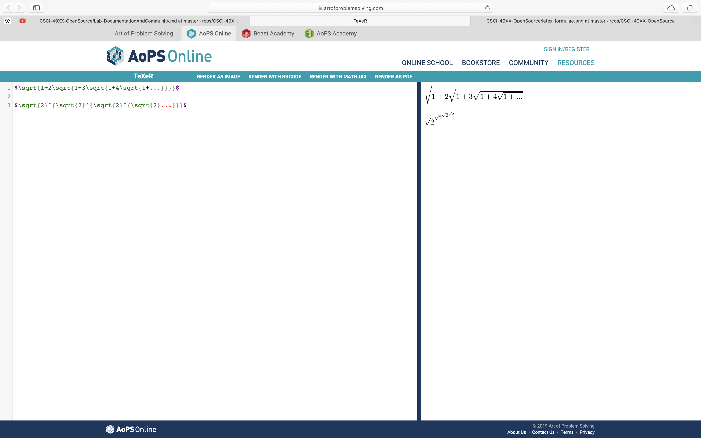
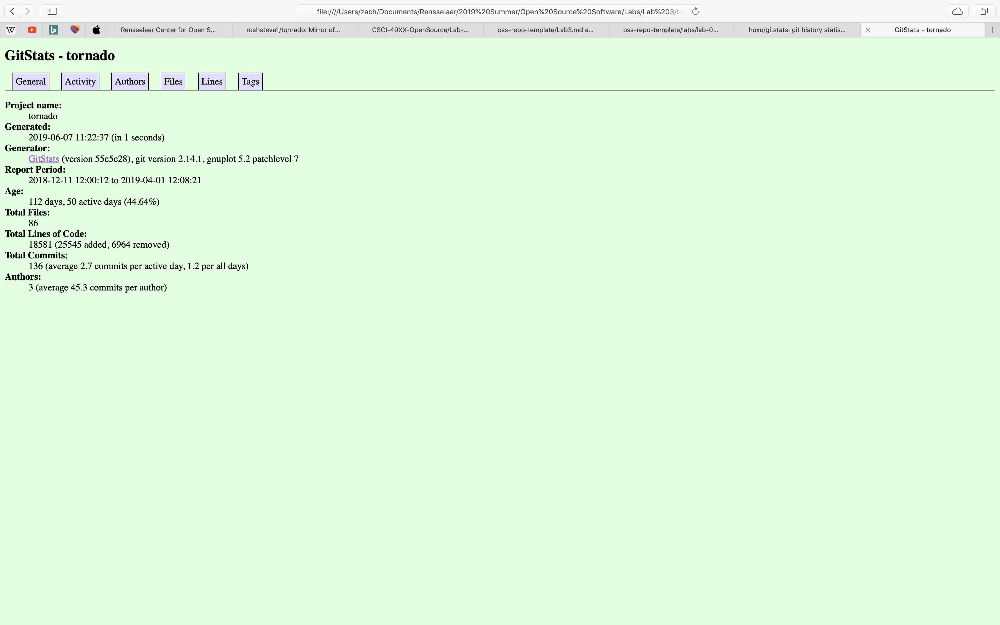

# Lab 3: Documentation and Community

## Part 1

[Project Idea Wiki Page](https://github.com/beshaz/oss-repo-template/wiki)

## Part 2

### Tornado
Number of Contributors: 3

Number of Lines of Code: 19487

First Commit: Tue Dec 11 12:00:12 2018 -0500

Last Commit: Mon Apr 1 16:08:21 2019 +0000

Number of Branches (online & local): 1

### Venue
Number of Contributors: 14

Number of Lines of Code: 68142

First Commit: Tuesday December 15, 2015

Last Commit: Tuesday June 4, 2019

Number of Branches: 31

### Smart Calendar
Number of Contributors: 2

Number of Lines of Code: 844

First Commit: January 14, 2019

Last Commit: April 26, 2019

Current Branches: "master" and "add-license-1"

### YACS
Number of Contributors: 48

Number of Lines of Code: 26695

First Commit: September 16, 2015

Last Commit: March 5, 2017

Number of Branches: 14

## Gitstats - Tornado
In the prior part of the lab, Tornado was found to have 19487 lines of code, while GitStats reports the project has 18581 lines of code.  The first commit was in December 2018 in GitStats and the last commit was in April 2019 in GitStats, which matches the commits previously found.  Both GitHub and GitStats reported that Tornado had three contributors.

## Gource Video - Tornado

