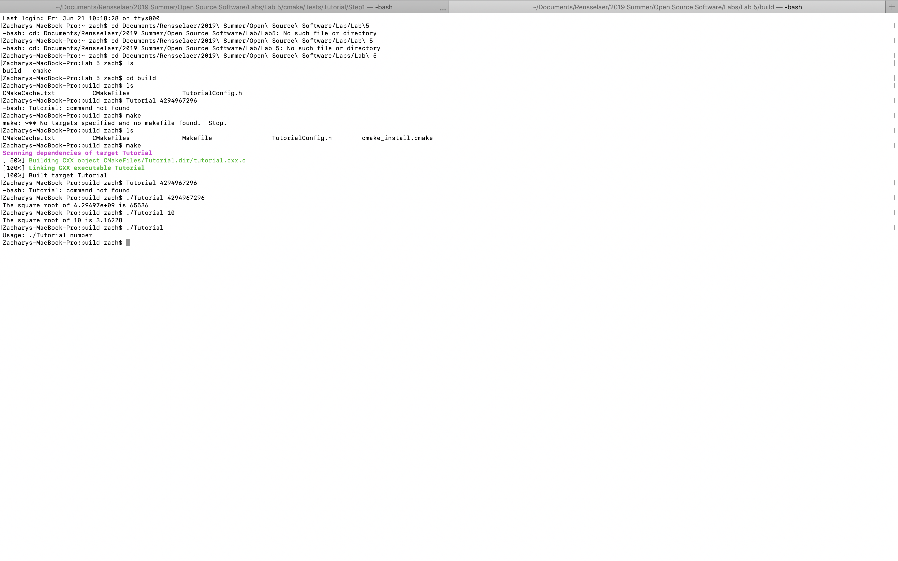

# Lab 5: Build Systems

## CMake Tutorial

### Step 1
[Step 1 Files](lab-05-files/Step%201)

### Step 2

[Step 2 Files](lab-05-files/Step%202)

### Step 3

[Step 3 Files](lab-05-files/Step%203)

### Step 4

[Step 4 Files]lab-05-files/Step%204)

### Step 5

[Step 5 Files](lab-05-files/Step%205)

