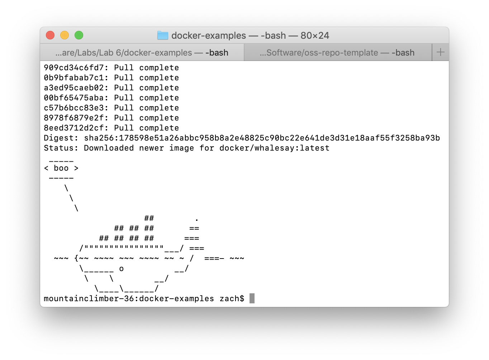
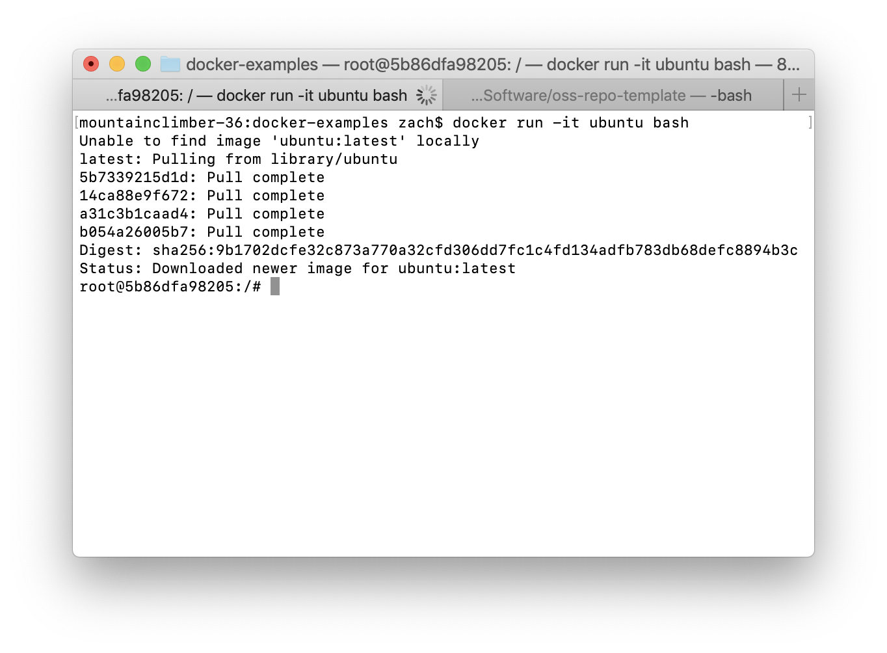
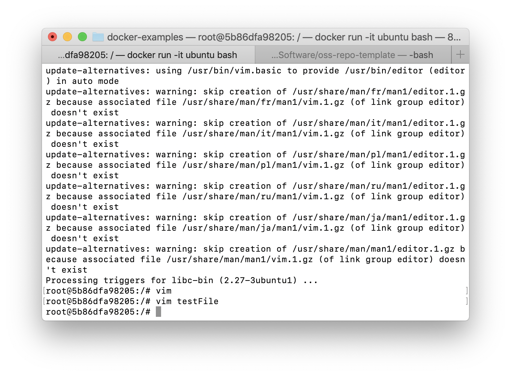

# Lab 6: Virtualization

## Example 0

## Example 1

## Example 2
Issue with example: After running the commands for creating the database and running rocketchat, when attempting to access rocketchat at localhost:3000 the page either returns an error or infinitely loads.  Therefore rocketchat was never successfully seen on localhost.

## Example 3

## Example 4

