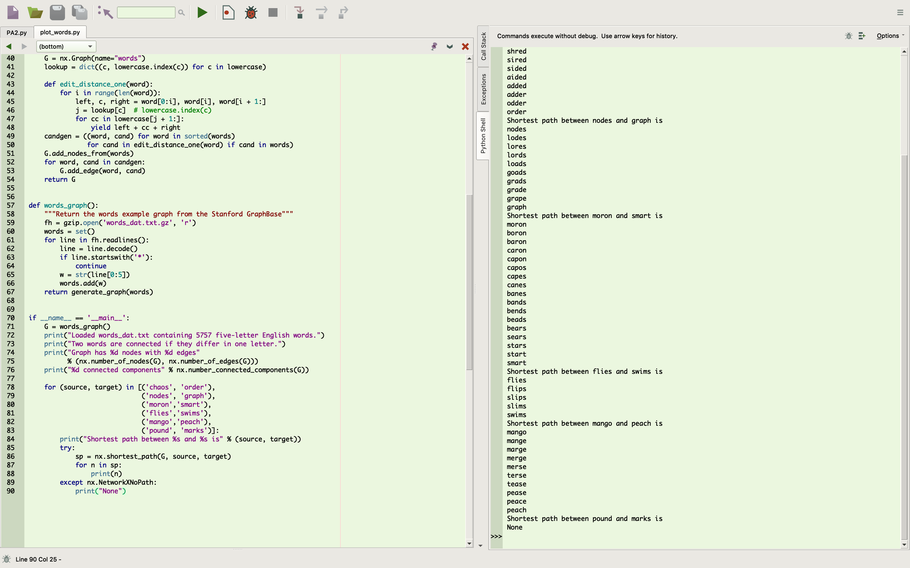

# Lab 7: Scientific Computing

## Example Histogram

## Words of Length 5 Test
[Length 5 Test Code](lab-07-code/plot_words_part_1.py)

## Words of Length 4 Test
[Length 4 Test Code](lab-07-code/plot_words_part_3.py)

## Scrambled Words of Length 5 Test
[Scrambled Test Code](lab-07-code/plot_words_part_4.py)

